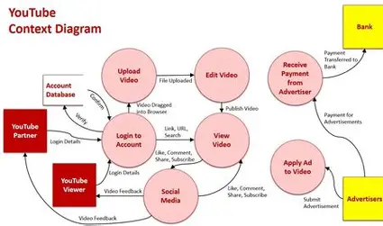

# React + Vite
Welcome to my YouTube Clone project! This is a front-end replica of the YouTube homepage, designed using HTML and CSS, javascript , ReactJs. It mimics the layout and styling of the original YouTube interface, focusing on responsiveness and clean design.
This template provides a minimal setup to get React working in Vite with HMR and some ESLint rules.

Currently, two official plugins are available:

- [@vitejs/plugin-react](https://github.com/vitejs/vite-plugin-react/blob/main/packages/plugin-react/README.md) uses [Babel](https://babeljs.io/) for Fast Refresh
- [@vitejs/plugin-react-swc](https://github.com/vitejs/vite-plugin-react-swc) uses [SWC](https://swc.rs/) for Fast Refresh

Features
🎥 Video thumbnails with titles and channel info

📱 Fully responsive layout

🔍 Search bar

📂 Sidebar with menu icons

🌙 Dark mode styling (optional)

A *flowchart* is a visual representation of a process, system, or algorithm, using various symbols to denote different types of actions or steps and arrows to show the flow of control. Typically, rectangles are used to represent processes or instructions, diamonds for decision points, ovals for start or end points, and arrows to indicate the direction of flow. Flowcharts help simplify complex tasks, making it easier to understand, analyze, and communicate how a particular process works. They are widely used in programming, system design, business analysis, and project management to outline logic, plan workflows, or identify potential errors and inefficiencies before actual implementation.

  

Technologies Used
HTML5 -  HTML is the backbone of any web page. In this project, HTML is used to structure the layout of the YouTube Clone — including the header, sidebar, video cards, thumbnails, and footer. It defines what content appears on the page and in what order.

JavaScript -JavaScript adds interactivity to the static HTML and CSS structure. It can be used to create dynamic behaviors such as clicking on the menu to open/close the sidebar, dark mode toggle, or search bar functionality. It enhances the user experience by making the site interactive like real YouTube.

CSS3 - CSS is used to style the HTML structure, making the webpage visually appealing. It defines colors, fonts, layout, spacing, and responsiveness. In the YouTube Clone, CSS handles the modern look and feel, grid layout for videos, sidebar styling, hover effects, and ensures the website adapts to different screen sizes (responsive design).

Responsive Design (Media Queries in CSS) - A responsive layout ensures your site works well on all devices—desktops, tablets, and smartphones. In your clone, media queries help adjust elements like the navigation bar and video grid depending on the screen size.

Git & GitHub - Git helps in tracking changes in the code, while GitHub is used for hosting and sharing the project publicly. It also helps with collaboration and version control, making your project professional and accessible for others to view or contribute.

React JS is a powerful JavaScript library developed by Facebook, used for building fast, interactive, and component-based user interfaces. It allows developers to break down complex UIs into small, reusable components, which makes code easier to manage and update.

In a project like a YouTube Clone, React can be used for:

🔁 Reusability: Components like VideoCard, Sidebar, Header, and SearchBar can be reused across different pages or sections of the app.

⚡ Fast Rendering: React uses a virtual DOM, which updates only the changed parts of the page, making the UI more efficient and faster.

📦 State Management: You can easily manage dynamic data like video lists, search queries, or theme toggles using React’s built-in useState and useEffect hooks.

🔍 Real-Time Updates: React can fetch and display live data (e.g., trending videos) from APIs without reloading the whole page.

🧱 Component Structure: Makes the codebase modular and maintainable, perfect for scaling up your clone from a static layout to a dynamic web app.

🔄 Routing: With React Router, you can navigate between pages (like home, video detail, or channel pages) without reloading the site, mimicking the single-page application (SPA) behavior of YouTube.

  
